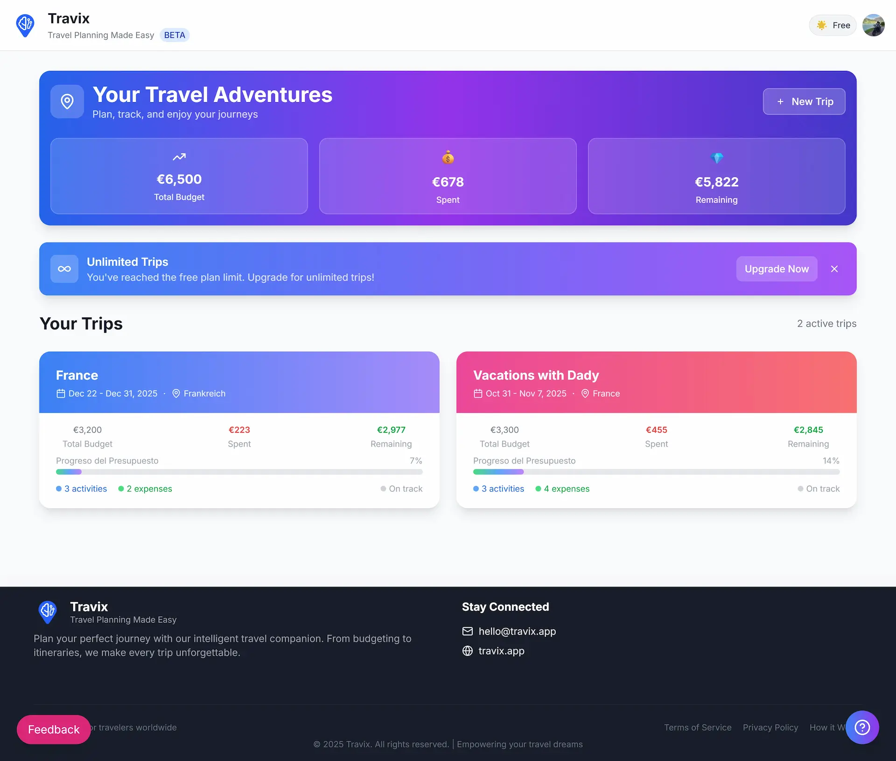
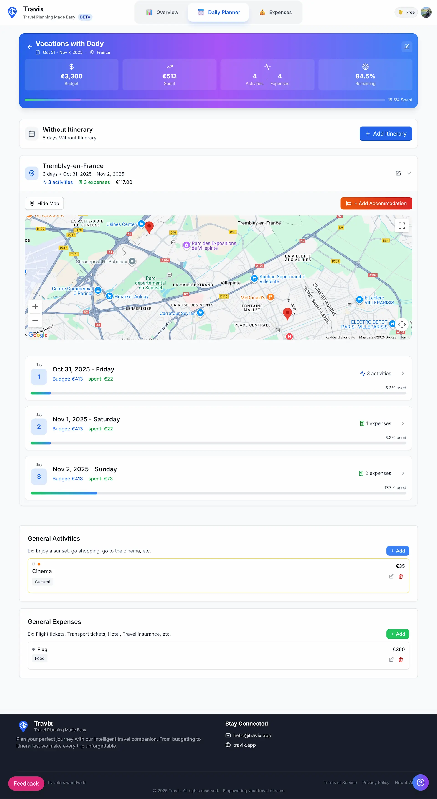

# Travix

Your AI-powered travel companion for seamless itinerary planning and exploration.


---

## Architecture & Technical Decisions

This project is built as a **High-Performance Single Page Application (SPA)** using **Vite**. While my portfolio highlights extensive experience with Next.js and SSR architectures, the choice for this MVP was deliberate:

- **Unmatched Developer Experience (DX):** Vite's instant Hot Module Replacement (HMR) and lightning-fast build times allowed for rapid prototyping and iteration.
- **Client-Side Agility:** Since Travix is a highly interactive tool where users manage complex itineraries, a pure SPA approach minimizes server round-trips for navigation, providing a fluid, "app-like" feel.
- **Future-Proofing:** The architecture is designed with a modular component-based approach. If SEO requirements or initial load performance targets shift, the decoupled nature of the frontend ensures a streamlined migration path to a Server-Side Rendering (SSR) framework like Next.js or Astro in the future.

---

## 📸 Screenshots

<div align="center">
  
  &nbsp;
  
</div>

---

## Features

- 🌍 **AI-Powered Itinerary Planner:** Leverage intelligent suggestions to build your perfect trip in seconds.
- 📍 **Interactive Mapping:** Full integration with **Google Maps API** and **MapBox** for visual route planning and place discovery.
- 🏷️ **Smart Categorization:** Automatically group activities (Dining, Sightseeing, Relaxation) with custom category badges.
- 🔒 **Robust Authentication:** Secure user management powered by **Supabase Auth**, including Google social login.
- 📊 **AI Usage Monitoring:** Transparent tracking of AI resource usage and user tier management (Premium/Free).
- 🌐 **Global i18n:** Multi-language support (English, Spanish, German) managed via `i18next`.
- 🌓 **Theming:** Seamless Dark/Light mode transitions for better accessibility.

---

## Tech Stack

### Core

- **React:** `^19.2.1`
- **TypeScript:** `^5.5.3`
- **Vite:** `^5.4.2`
- **Tailwind CSS:** `^3.4.1`

### State Management & Data Fetching

- **TanStack Query (React Query):** `5.83.0` - Advanced caching and server state management.
- **Supabase JS:** `2.50.2` - Real-time database and authentication.

### Geospatial & UI

- **React Google Maps API:** `^2.19.3`
- **React Router Dom:** `7.6.2`
- **Lucide React & Heroicons:** Providing a modern, consistent icon set.
- **i18next:** `25.2.1` for internationalization.

### Testing & Quality

- **Vitest:** `^3.2.4` - Blazing fast unit and integration tests.
- **Testing Library:** `@testing-library/react` (v16.3.0) for accessible component testing.
- **ESLint:** `^9.9.1` with custom configurations.

---

## Getting Started

### 1. Prerequisites

- **Node.js:** `>= 20.0.0`
- **npm:** `>= 10.0.0`

### 2. Installation

Clone the repository and install dependencies:

```bash
git clone https://github.com/risuiar/travix-react.git
cd travix-react
npm install
```

### 3. Environment Setup

Rename `env.example` to `.env` and fill in your Supabase and API credentials:

```bash
cp env.example .env
```

> [!IMPORTANT]
> Ensure you have your Google Maps and Supabase keys ready before running the project.

### 4. Run Development Server

```bash
npm run dev
```

Open `http://localhost:3000` to view the application.

### 5. Deployment

The project includes a robust build pipeline:

```bash
npm run build:prod
```

---

## Author

**Ricardo Vögeli** - Senior Frontend Engineer  
[Website](https://r-m-v.com) | [LinkedIn](https://www.linkedin.com/in/ricardovoegeli/)

## License

MIT License - Copyright (c) 2025 Travix Team.
